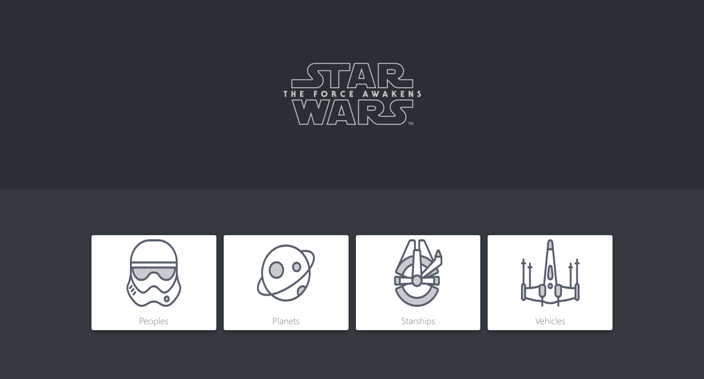
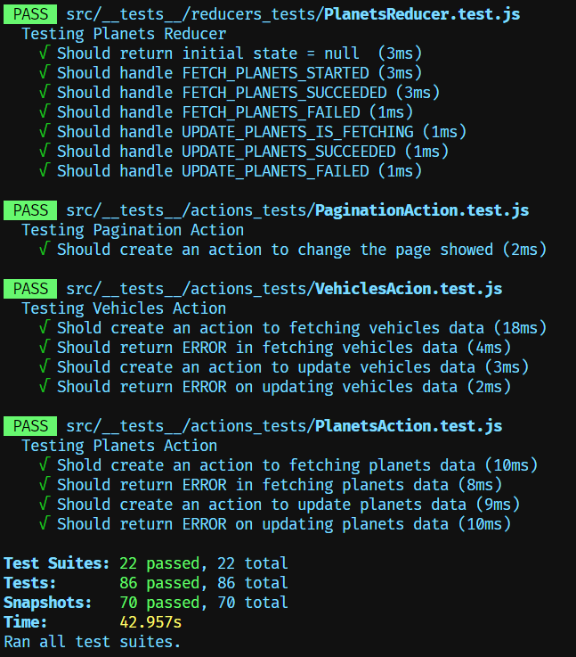
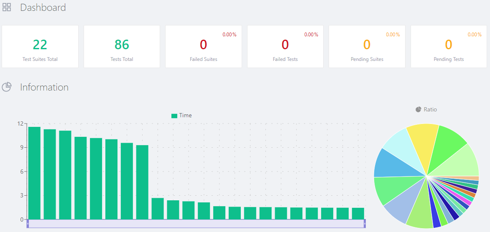
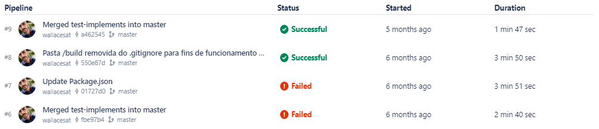
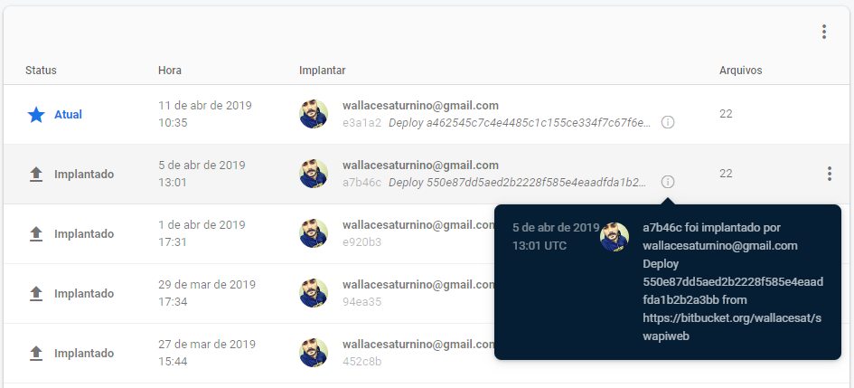

# Starwars front-end API

A simple web application that makes use of a fictional Star Wars data api and displays them on screen, sorting them into a table according to the selected category, these categories being people, spaceships, planets and vehicles.

## Getting started

##### In your prefer local path:

- `git clone https://github.com/wallacesat/Starwars-front-api`
- `cd Starwars-front-api`
- `yarn install`
- `yarn start`

> If you prefer, use `npm` instead of `yarn`

After the server starts successfully, you can make requests to the end points of this api.

> #### NOTE
>
> You will need internet access, because even if the API is running locally, the data collection is stored in an online database.

## Getting tested

##### In your local path project:

- `yarn test`
- `then press 'a' keyto test all components`

> If you prefer, use `npm` instead of `yarn`

##### The test result will be printed on the terminal as the example below:

## Coverage
When running the test a code coverage report will be generated.

`To view this report, simply go to the root of the project and open the file 'jest_html_reporters.html' in your browser.`

##### The detailed coverage report will be displayed as the example below:

## Continuous integration
The continuous integration of this application was accomplished through the bitbucket pipeline.
Where a battery of automated unit tests runs, and if all tests pass, the application deploy is approved and done automatically.

##### You can see below a part of the pipeline history generated by bitbucket right after the automated tests run:

##### And to make sure everything went as expected, below you can view the log of the hosting Firebase, the successful deployment was automatically:

## Frameworks

#### [Axios](https://github.com/axios/axios)

To handle HTTP browser requests.

#### [Reactstrap](https://reactstrap.github.io/)

In this application this module was used for the implementation of the tables.

#### [React-router-dom](https://reacttraining.com/react-router/web/guides/quick-start)

For managing internal navigation, between the pages of this application.

#### [Redux](https://redux.js.org/)

For centralization and management of application state.

#### [ExpressJS](https://expressjs.com/)

For management of routing system, routes, HTTP requests and responses.

#### [Cross-env](https://www.npmjs.com/package/cross-env)

For multiplatform environment variable definition.

#### [Npm-run-all](https://www.npmjs.com/package/npm-run-all)

To enable the execution of multiple scripts. This allows two applications to be started in parallel.

## Fake API and Database

#### [Json-schema-faker](https://github.com/json-schema-faker/json-schema-faker)

For simulating an API with fake data. Enables front-end development without prior access to a real API.

#### [Chance](https://chancejs.com/)

To generate the random data that will compose the api fake database.

#### [Chalk](https://github.com/chalk/chalk)

To color the words printed on the terminal output.

## Test tools

#### [Jest](https://jestjs.io/)

To perform unit testing of application components.

#### [Enzyme](https://airbnb.io/enzyme/)

For the simulation of the states and returns of attributes and properties of components, thus enabling the unit test on each component separately, detaching them from the dependencies of other isolated components.

#### [Redux-mock-store](https://github.com/dmitry-zaets/redux-mock-store)

To perform the tests on the components linked to the application store, which in this case is managed by Redux.

#### [Nock](https://github.com/nock/nock)

To simulate the return of HTTP requests, manipulating the data and status, thus enabling the test alone in the components that perform this type of request.

## Languages

- Javascript - [w3school: JS tutorial](https://www.w3schools.com/js/)
- ES6 - [ECMAScript 2015: Specification](https://www.ecma-international.org/ecma-262/6.0/)
- JSX Sintax - [React: JXS introduction](https://pt-br.reactjs.org/docs/introducing-jsx.html)
- CSS - [w3school: CSS tutorial](https://www.w3schools.com/css/)

## License

MIT © [wallacesat](https://github.com/wallacesat/)
